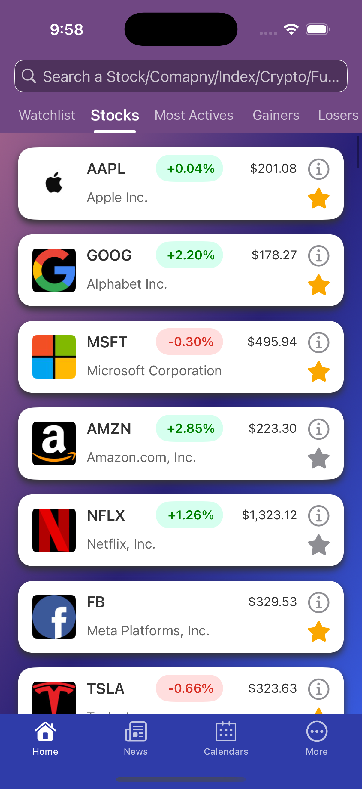
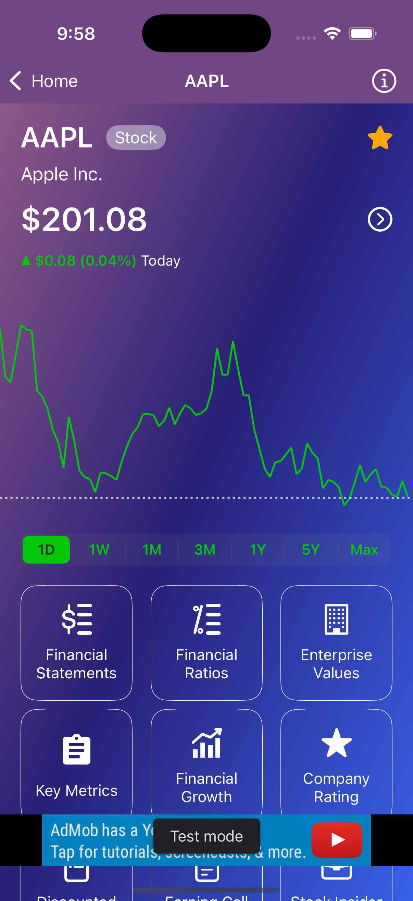
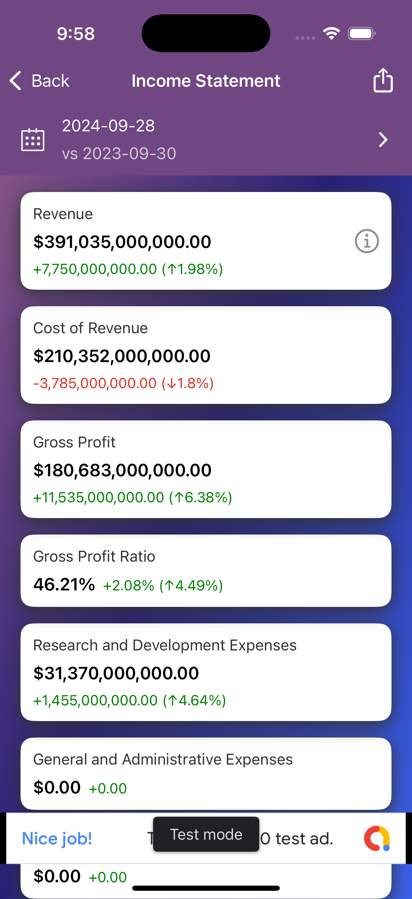

# Finance Go 📈

A comprehensive iOS financial app that provides real-time stock market data, financial statements, ratios, and investment analysis tools.

## 📱 Screenshots

<div align="center">
  
  
  
</div>


## 📱 Features

### 🏠 Home Dashboard
- **Stock Quotes**: Real-time stock prices and market data
- **Financial Statements**: Income statements, balance sheets, and cash flow statements
- **Financial Ratios**: Comprehensive ratio analysis and calculations
- **Enterprise Values**: Company valuation metrics
- **Key Metrics**: Essential financial performance indicators
- **Company Ratings**: Investment recommendations and ratings
- **Stock Charts**: Interactive price charts with multiple timeframes

### 📊 Market Coverage
- **US Stocks**: Complete coverage of US stock market
- **Major Indexes**: S&P 500, Dow Jones, NASDAQ tracking
- **Cryptocurrencies**: Real-time crypto prices and news
- **ETFs & Funds**: Exchange-traded funds and mutual funds
- **Futures**: Commodity and financial futures
- **Forex**: Foreign exchange rates and analysis

### 📰 News & Analysis
- **Financial News**: Latest market news and company updates
- **Economic Calendar**: Earnings announcements and economic events
- **Company News**: Stock-specific news and developments
- **Market Analysis**: Expert insights and market commentary

### 📅 Economic Calendar
- **Earnings Calendar**: Upcoming earnings releases
- **Economic Events**: Important economic indicators and events
- **Market Holidays**: Trading calendar and market closures

### 🔧 Additional Features
- **Watchlist**: Custom stock portfolios
- **Financial Definitions**: Educational content for financial terms
- **Multi-language Support**: English, Chinese (Simplified/Traditional), Japanese
- **Offline Caching**: Data persistence for offline access
- **Dark Mode Support**: Modern UI with dark theme

## 🛠 Technical Stack

### Core Technologies
- **Swift**: Primary programming language
- **UIKit**: iOS user interface framework
- **Core Data**: Local data persistence
- **Alamofire**: Network requests and API integration

### Key Dependencies
- **SnapKit**: Auto Layout DSL
- **Kingfisher**: Image loading and caching
- **Charts**: Interactive charting library
- **SwiftyJSON**: JSON parsing
- **Localize-Swift**: Internationalization
- **JTAppleCalendar**: Calendar functionality
- **MJRefresh**: Pull-to-refresh functionality

### APIs & Services
- **[Financial Modeling Prep API](https://site.financialmodelingprep.com/developer/docs)**: Real-time financial data provider
- **Google Mobile Ads**: Advertisement integration
- **Firebase**: Analytics and crash reporting

## 📋 Requirements

- iOS 11.0+
- Xcode 12.0+
- Swift 5.0+
- CocoaPods

## 🚀 Installation

1. **Clone the repository**
   ```bash
   git clone https://github.com/banghuazhao/finance-go.git
   cd finance-go
   ```

2. **Install dependencies**
   ```bash
   cd finance-go
   pod install
   ```

3. **Open the workspace**
   ```bash
   open finance-go.xcworkspace
   ```

4. **Configure API Keys**
   - Add your Financial Modeling Prep API key in `Constants.swift`
   - Configure Firebase settings if needed

5. **Build and run**
   - Select your target device or simulator
   - Press `Cmd + R` to build and run

## 🏗 Project Structure

```
finance-go/
├── finance-go/
│   ├── Home/                 # Main dashboard and stock views
│   ├── News/                 # News and articles
│   ├── Calendars/            # Economic calendar
│   ├── More/                 # Settings and additional features
│   ├── Tool/                 # Utilities and extensions
│   ├── Resource/             # Static data files
│   └── Assets.xcassets/      # App icons and images
├── Podfile                   # CocoaPods dependencies
└── README.md                 # This file
```

## 🌍 Localization

The app supports multiple languages:
- English (en)
- Chinese Simplified (zh-Hans)
- Chinese Traditional (zh-Hant)
- Japanese (ja)

Localization files are located in the respective `.lproj` folders.

## 📊 Data Sources

- **[Financial Modeling Prep API](https://site.financialmodelingprep.com/developer/docs)**: Real-time financial data and statements
- **Market APIs**: Stock quotes, crypto prices, forex rates
- **News APIs**: Financial news and market updates

## 🤝 Contributing

1. Fork the repository
2. Create your feature branch (`git checkout -b feature/AmazingFeature`)
3. Commit your changes (`git commit -m 'Add some AmazingFeature'`)
4. Push to the branch (`git push origin feature/AmazingFeature`)
5. Open a Pull Request

## 📄 License

This project is licensed under the MIT License - see the [LICENSE](LICENSE) file for details.

## 👨‍💻 Author

**Banghua Zhao**
- GitHub: [@banghuazhao](https://github.com/banghuazhao)

## 🙏 Acknowledgments

- [Financial Modeling Prep](https://site.financialmodelingprep.com/developer/docs) for providing comprehensive financial data APIs
- The open-source community for the excellent libraries used in this project
- All contributors and users who have provided feedback and suggestions

---

⭐ If you find this project helpful, please give it a star on [GitHub](https://github.com/banghuazhao/finance-go)! 